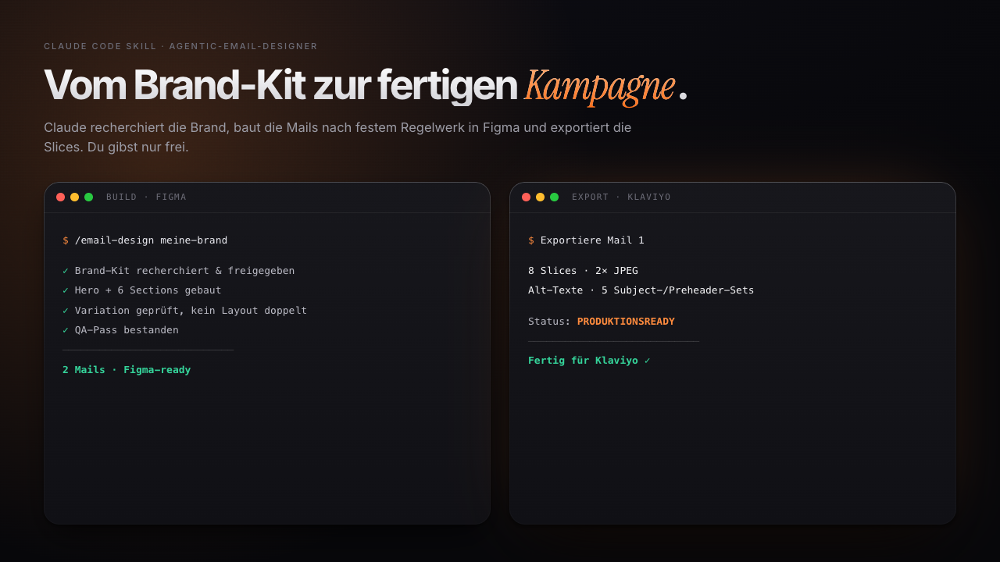

# agentic-email-designer



Von Null zu fertigen Marketing-E-Mail-Designs für deine Brand, gebaut mit Claude Code und Figma. Du lieferst Brand-Infos und gibst frei, Claude recherchiert, designt in deinem Figma und exportiert fertige Bild-Slices für Klaviyo und Co.

*Der immer gleiche Teil an einer Mail-Kampagne (Hero, Sections, QA, Export) frisst die meiste Zeit, ohne dass er das Ergebnis besonders macht. Dieses System übernimmt genau diesen Teil, nach festen Regeln, damit keine zwei Mails gleich aussehen. Nimm es, setz deine Brand ein, bau los. Simon*

## Die Idee

Ein festes Regelwerk in `System/` definiert, wie eine gute Marketing-Mail aufgebaut ist: großer Hero mit XXL-Headline, ein Baukasten aus 23 Section-Typen, Variationspflicht (keine zwei Mails gleich), QA nach jedem Build, dann Export. Alles Brand-Spezifische (Farben, Fonts, Voice, Fakten, Bilder) lebt strikt getrennt davon in einem `Brands/<brand>/BRAND.md`. Der Skill `/email-design` verbindet beides: Er lädt das Regelwerk plus dein Brand-Kit und baut die Mails per Figma-Plugin-API direkt in deine Figma-Datei. Nichts wird erfunden. Fehlt etwas (ein Foto, eine belegbare Zahl, ein echtes Review), sagt Claude das, statt Platzhalter einzusetzen.

## Wie es funktioniert

Vier Dinge zählen:

- **`System/MASTER-EMAIL-SYSTEM.md`**: das Regelwerk (Hero-Aufbau, Section-Baukasten, QA, Export). Wird nicht angefasst.
- **`System/FIGMA-RECIPES.md`**: die technischen Figma-Plugin-Rezepte und bekannten Fallen. Wird nicht angefasst.
- **`Brands/<brand>/BRAND.md`**: dein Brand-Kit, die einzige Quelle aller Brand-Werte. Das füllst du gemeinsam mit Claude aus und gibst es frei.
- **`.claude/skills/email-design/`**: der `/email-design`-Skill, der alles orchestriert.

Zentrale Regel des Systems: Ohne von dir freigegebenes Brand-Kit wird keine Mail gebaut. Das schützt dich vor zehn Mails im falschen Look.

## Quick start

**Voraussetzungen:** Claude Code, ein Figma-Account mit Edit-Zugriff für die MCP-Verbindung, dazu deine Produktbilder und dein Logo. Die vollständige Einrichtung steht Schritt für Schritt in [SETUP.md](SETUP.md).

```bash
# 1. Repo holen
git clone https://github.com/simon-schaeferai/agentic-email-designer.git
# 2. Claude Code IN diesem Ordner starten
cd agentic-email-designer && claude
# 3. In Claude Code die Figma-Integration verbinden (Einstellungen, Connectors/MCP)
```

Wenn das steht, ist der Rest ein Prompt.

## So benutzt du es

```
/email-design meine-brand
```

Claude recherchiert deine Website, stellt dir eine Liefer-Liste (Logo, Font, Farben, Bilder, Fakten), baut daraus dein Brand-Kit und nach deiner Freigabe die Mails. Danach bestellst du Kampagnen einfach im Klartext:

```
Baue mir 5 E-Mails: 1x Launch, 1x Social Proof, 1x FAQ, 1x Bundle, 1x Restock.
```

## Design-Entscheidungen

- **Regelwerk und Brand strikt getrennt.** Das System ist brand-agnostisch, alle Brand-Werte kommen aus dem BRAND.md. Vorteil: ein System, beliebig viele Brands. Nachteil: der erste Lauf für eine neue Brand ist Setup-Arbeit, kein Ein-Klick.
- **Keine Produktion ohne Freigabe.** Bewusst ein harter Stopp. Vorteil: nie zehn Mails im falschen Look. Nachteil: du musst aktiv freigeben, es läuft nicht vollautomatisch.
- **Nichts erfinden.** Fakten und Reviews nur mit Quelle aus dem BRAND.md. Vorteil: keine peinlichen Falschaussagen in echten Kampagnen. Nachteil: fehlt Material, bleibt eine Section lieber leer als schön erfunden.
- **Figma statt HTML.** Designs entstehen als echte Figma-Frames, Export als Bild-Slices. Vorteil: volle gestalterische Freiheit, pixelgenau. Nachteil: du brauchst einen Figma-Account mit Edit-Rechten, kein reines Text-Tooling.

## Grenzen

- Kein fertiger, teilbarer Master-Library-Link im Repo. Jeder baut sich die Library im eigenen Figma (Weg A in [SETUP.md](SETUP.md), Kapitel 5).
- Kein HTML-E-Mail-Code als Output. Das System liefert Bild-Slices plus Alt-Texte, gedacht für Klaviyo und ähnliche Tools.
- Getestet mit Claude Code plus Figma-Connector. Andere Setups können abweichen.

## License

MIT
